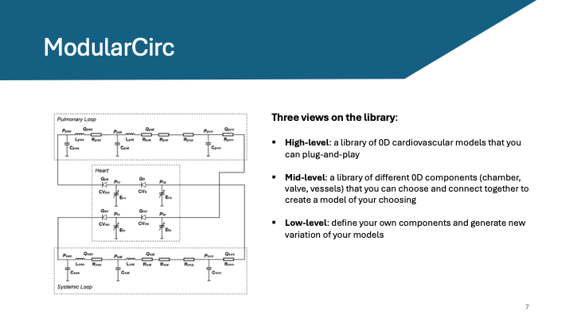

# A short  overview of Modularcirc

**ModularCirc** is intended to be a versatile platform of 0D models of the cardiovascular system.
It is users are envisioned to have different levels of expertise/experience coding.

## Goals
The main goal of this tutorial is to give you a flavour of the high and mid level uses **ModularCirc**.
This will cover:
- ### *Part I*:
    1) How to retrieve a model from the library.
    2) How to modify the parameters
    3) How to run the models (small intro to options)
    4) How to generate quick plots of the data/retrieve basic values from the model
- ### *Part II*:
    1) What is the structure of a model and supporting classes
    2) How to retrieve predefined components
    3) How to modify existing models with new components?
