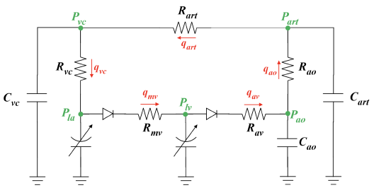

# Models directory
This folder contains the description of the model and model parameter classes defined in this module.
The models presented here are made of three types of components:
- *arteries*: RLC components (complex) and R components (simple)
- *chamber*: linear elatic (simple) and mixed (complex, linear active and exponential passive behaviour)
- *valves*: non-ideal diodes (simple), simple Bernoulli (medium), Maynard valves (complex, where the motion the valves is modelled).

## 1. Naghavi et al. model
Relevant files and classes:
- `ModularCirc/Models/NaghaviModel.py`, where the `NaghaviModel` class is defined
- `ModularCirc/Models/NaghaviModelParameters.py`, where the `NaghaviModelParameters` class is defined.

A CV model described in Rapid Estimation of Left Ventricular Contractility with a Physics-Informed Neural Network Inverse Modeling Approach (https://arxiv.org/html/2401.07331v1).
The model is comprised of the following components:
- LA: linear time-varying elastance model (6 parameters)
- MV: non-ideal diode model (1 parameter)
- LV: linear time-varying elastance model (5 parameters)
- AV: non-ideal diode model (1 parameter)
- Aorta: RC Windkessel model (2 parameters)
- Vena cava: RC Windkessel model (2 parameters)

**Total set of parameters sums up to 17.**

## 2. Korakianitis and Shi model
Relevant files and classes:
- `ModularCirc/Models/KorakianitisMixedModel.py`, where the `KorakianitisModel` class is defined
- `ModularCirc/Models/KorakianitisMixedModel_parameters.py`, where the `KorakianitisModel_parameters` class is defined

(TO BE EDITED BY MAX)

A simplified CV model described in A concentrated parameter model for the human cardiovascular system
including heart valve dynamics and atrioventricular interaction (https://www.sciencedirect.com/science/article/pii/S1350453305002195?via%3Dihub).
**Here, we simplified the model by eliminating (1) the motion of the annulus fibrosus and (2) the motion of the leaflets, replaced with a simple Bernoulli model.**
This model is comprised of the following components:
- left atrium: linear time-varying elastance model
    - **6 parameters**
- mitral valve: simple Bernoulli model
    - **2 parameters**
- left ventricle: linear time-varying elastance model
    - **5 parameters**
- aortic valve: simple Bernoulli model
    - **2 parameters**
- aortic sinus (RLC 3 component windkessel)
    - **4 parameters**
- arteries (RLC 3 component windkessel) + arteriole (R) + capilary (R)
    - for practical reasons the 3 resistors are summed up into one parameter
    - **4 parameters**
-  systemic venous system (RLC 3 component windkessel)
    - **3 parameters** (assume that venous impedance is zero)
- right atrium: linear time-varying elastance model
    - **6 parameters**
- tricuspid valve: simple Bernoulli model
    - **2 parameters**
- right ventricle: linear time-varying elastance model
    - **5 parameters** 
- pulmonary valve: simple Bernoulli model
    - **2 parameters**
- pulmonary artery sinus (RLC 3 component windkessel)
    - **4 parameters**
- pulmonary arteries (RLC 3 component windkessel) + pulmonary arteriole (R) + pulmonary capilary (R)
    - **4 parameters**
- pulmonary venous system (RLC 3 component windessel)
    - **3 parameters** (assume that venous impedance is zero)

**Total set of parameters sums up to 55.**

