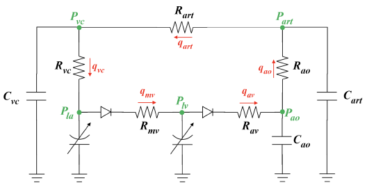

# Models directory
This folder contains the description of the model and model parameter classes defined in this module.
The models presented here are made of three types of components:
- *arteries*: RLC components (complex) and R components (simple)
- *chamber*: linear elastic (simple) and mixed (complex, linear active and exponential passive behaviour)
- *valves*: non-ideal diodes (simple), simple Bernoulli (medium), Maynard valves (complex, where the motion the valves is modelled).

## 1. Naghavi et al. model
Relevant files and classes:
- `src/ModularCirc/Models/NaghaviModel.py`, where the `NaghaviModel` class is defined
- `src/ModularCirc/Models/NaghaviModelParameters.py`, where the `NaghaviModelParameters` class is defined.

A CV model described in Rapid Estimation of Left Ventricular Contractility with a Physics-Informed Neural Network Inverse Modeling Approach (https://arxiv.org/html/2401.07331v1).
The model is comprised of the following components:
- LA: linear time-varying elastance model (6 parameters)
- MV: non-ideal diode model (1 parameter)
- LV: linear time-varying elastance model (5 parameters)
- AV: non-ideal diode model (1 parameter)
- Aorta: RC Windkessel model (2 parameters)
- Vena cava: RC Windkessel model (2 parameters)

**Total set of parameters sums up to 17.**

## 2. Korakianitis and Shi model
Relevant files and classes:
- `src/ModularCirc/Models/KorakianitisMixedModel.py`, where the `KorakianitisMixedModel` class is defined
- `src/ModularCirc/Models/KorakianitisMixedModel_parameters.py`, where the `KorakianitisMixedModel_parameters` class is defined

A simplified CV model described in A concentrated parameter model for the human cardiovascular system
including heart valve dynamics and atrioventricular interaction (https://www.sciencedirect.com/science/article/pii/S1350453305002195?via%3Dihub).
**In KorakianitisMixedModel, we simplified the model by eliminating (1) the motion of the annulus fibrosus, (2) the motion of the leaflets, replaced with a simple Bernoulli model and (3) the cardiac chamber laws are replaced with mixed law (exponential for the passive filling and linear for contraction).**
This model is comprised of the following components:
- left atrium: time-varying elastance model, based on weighted sum of passive (exponential) and active (linear) laws
    - **7 parameters**
- mitral valve: simple Bernoulli model
    - **2 parameters**
- left ventricle: time-varying elastance model, based on weighted sum of passive (exponential) and active (linear) laws
    - **6 parameters**
- aortic valve: simple Bernoulli model
    - **2 parameters**
- aortic sinus (RLC 3 component windkessel)
    - **4 parameters**
- arteries (RLC 3 component windkessel) + arteriole (R) + capilary (R)
    - for practical reasons the 3 resistors are summed up into one parameter
    - **4 parameters**
-  systemic venous system (RLC 3 component windkessel)
    - **3 parameters** (assume that venous impedance is zero)
- right atrium: time-varying elastance model, based on weighted sum of passive (exponential) and active (linear) laws
    - **7 parameters**
- tricuspid valve: simple Bernoulli model
    - **2 parameters**
- right ventricle: time-varying elastance model, based on weighted sum of passive (exponential) and active (linear) laws
    - **6 parameters**
- pulmonary valve: simple Bernoulli model
    - **2 parameters**
- pulmonary artery sinus (RLC 3 component windkessel)
    - **4 parameters**
- pulmonary arteries (RLC 3 component windkessel) + pulmonary arteriole (R) + pulmonary capilary (R)
    - **4 parameters**
- pulmonary venous system (RLC 3 component windessel)
    - **3 parameters** (assume that venous impedance is zero)

**Total set of parameters sums up to 57.**

---

> **Note:** The models below are experimental / under active development and are not yet part of the published package release.

## 3. Korakianitis and Shi model (original — constant elastance)

Relevant files and classes:
- `src/ModularCirc/Models/KorakianitisModel.py`, where the `KorakianitisModel` class is defined
- `src/ModularCirc/Models/KorakianitisModel_parameters.py`, where the `KorakianitisModel_parameters` class is defined

The original 14-component Korakianitis and Shi model using **constant (linear) time-varying elastance** (`HC_constant_elastance`) for all four cardiac chambers and simple Bernoulli valves. This corresponds most closely to the published formulation, before the mixed-elastance simplification introduced in `KorakianitisMixedModel`.

## 4. Korakianitis Mixed model — pressure/volume variant (KorakianitisMixedModelPP)

Relevant files and classes:
- `src/ModularCirc/Models/KorakianitisMixedModelPP.py`, where the `KorakianitisMixedModelPP` class is defined
- Uses `KorakianitisMixedModel_parameters` (shared with model 2)

A variant of `KorakianitisMixedModel` in which cardiac chambers use the `HC_mixed_elastance_pp` component — a pressure/volume formulation of the mixed elastance law. All other components (valves, vessels) are identical to model 2.

## 5. Korakianitis Maynard model (KorakianitisMaynardModel)

Relevant files and classes:
- `src/ModularCirc/Models/KorakianitisMaynardModel.py`, where the `KorakianitisMaynardModel` class is defined
- `src/ModularCirc/Models/KorakianitisModel_parameters.py`, where the `KorakianitisModel_parameters` class is defined

A variant of `KorakianitisModel` in which simple Bernoulli valves are replaced with **Maynard valves** (`Valve_maynard`) that model the full dynamics of valve leaflet motion. Cardiac chambers use constant elastance (`HC_constant_elastance`).

## 6. Korakianitis Mixed Maynard model (KorakianitisMixedMaynardModel)

Relevant files and classes:
- `src/ModularCirc/Models/KorakianitisMixedMaynardModel.py`, where the `KorakianitisMixedMaynardModel` class is defined
- `src/ModularCirc/Models/KorakianitisModel_parameters.py`, where the `KorakianitisModel_parameters` class is defined

Combines **mixed elastance chambers** (`HC_mixed_elastance`) with **Maynard valves** (`Valve_maynard`). Targets the highest fidelity within the Korakianitis family by coupling physiologically realistic chamber laws with full valve leaflet dynamics.

## 7. Five-segment pulmonary Mixed model (KPat5MixedModel)

Relevant files and classes:
- `src/ModularCirc/Models/KPat5MixedModel.py`, where the `KPat5MixedModel` class is defined
- `src/ModularCirc/Models/KorakianitisModel_parameters.py`, where the `KorakianitisModel_parameters` class is defined

A variant of `KorakianitisMixedModel` in which the pulmonary arterial system is split into **five parallel RLC segments** (`PulArt0`–`PulArt4`) instead of a single compartment. Intended for patient-specific modelling of pulmonary arterial hypertension with heterogeneous vessel properties.

## 8. Mixed Heart Maynard 4-element Windkessel (MixedHeartMaynard4eWindkessel)

Relevant files and classes:
- `src/ModularCirc/Models/MixedHeartMaynard4eWindkessel.py`, where the `MixedHeartMaynard4eWindkessel` class is defined
- `src/ModularCirc/Models/MixedHeartMaynard4eWindkessel_parameters.py`, where the `MixedHeartMaynard4eWindkessel_parameters` class is defined

Uses **mixed elastance chambers** (`HC_mixed_elastance`), **Maynard valves** (`Valve_maynard`), and a **4-element Windkessel** for both systemic and pulmonary circulations. The 4-element Windkessel adds a characteristic impedance resistor and a separate capillary resistor (`R_component`) to the standard 3-element RLC Windkessel, providing improved high-frequency impedance matching.
